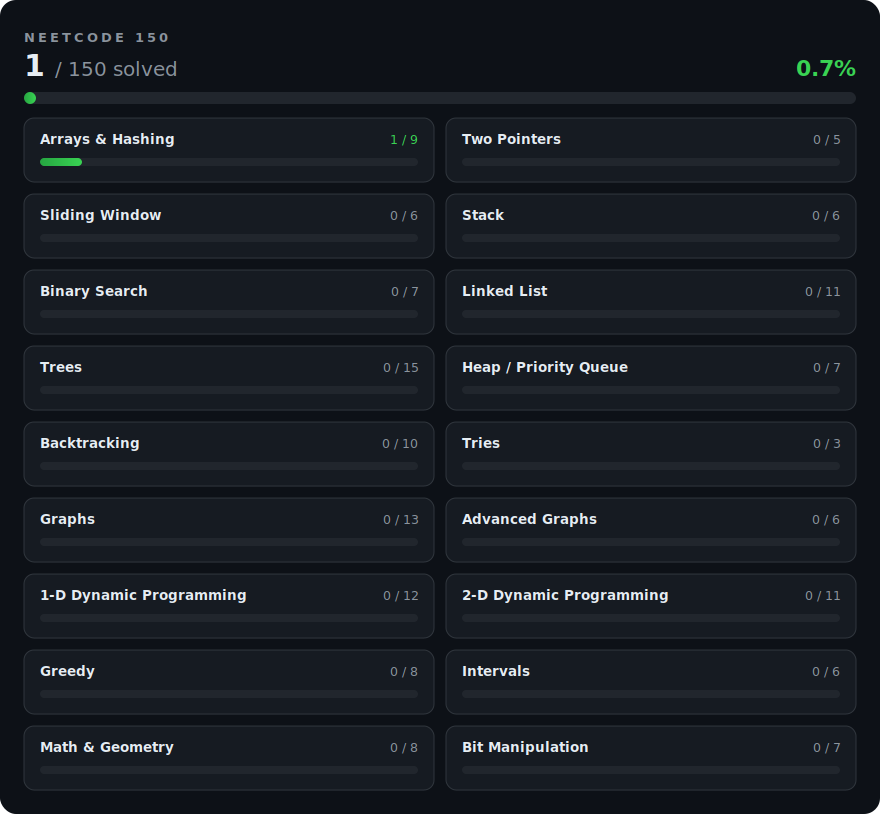

# NeetCode 150 C++ Solutions

Working through the [NeetCode 150](https://neetcode.io/practice), a curated list of 150 algorithm problems that covers the 18 core patterns behind technical interviews: from arrays and hashing through graphs, dynamic programming and bit manipulation.

All solutions are written in modern C++.

<p align="center">
  
</p>

## How this repo is organized

Every problem lives in `solutions/`, one folder per pattern, ordered to match the NeetCode roadmap:

```
solutions/
├── 01_arrays_hashing/      ├── 07_trees/                ├── 13_dp_1d/
├── 02_two_pointers/        ├── 08_heap_priority_queue/  ├── 14_dp_2d/
├── 03_sliding_window/      ├── 09_backtracking/         ├── 15_greedy/
├── 04_stack/               ├── 10_tries/                ├── 16_intervals/
├── 05_binary_search/       ├── 11_graphs/               ├── 17_math_geometry/
└── 06_linked_list/         └── 12_advanced_graphs/      └── 18_bit_manipulation/
```

Each solution is a single self-contained `.cpp` file. The header comment states the problem, a link to it, the approach in a few sentences and the time and space complexity. The goal is that any file can be opened on its own and understood in under a minute.

Longer-form notes and cheat sheets (for example on hash containers in C++) live in `notes/`.

## Why this list

The NeetCode 150 is deliberately pattern-based rather than volume-based. Solving it end to end demonstrates breadth across every standard data structure and algorithm family, not repetition of one trick. The progress dashboard above is generated from the actual solution files in this repo, so the numbers always reflect committed, working code.

<details>
<summary>Maintenance: how the dashboard is generated</summary>

<br>

`scripts/update_progress.py` counts the `.cpp` files in each pattern folder and regenerates `assets/progress.svg`. After adding a solution:

```sh
python3 scripts/update_progress.py
```

</details>
